# Teste de Diagramas Mermaid

Este documento demonstra diversos tipos de diagramas que podem ser criados com Mermaid.js.

## Como Usar

Clique em qualquer diagrama para abri-lo em um modal interativo com:
- � **Zoom automático** - diagrama abre ocupando o máximo espaço possível
- �🔍 Zoom manual de 50% a 1000%
- 🖱️ Arrastar para navegar
- ◀️ ▶️ **Navegação entre diagramas** (setas < > ou ← →)
- ⌨️ Atalhos de teclado (F para fullscreen, Esc para fechar)
- �️ Modo fullscreen
- 📊 Contador de diagramas (ex: "2 de 12")

---

## 1. Fluxograma (Flowchart)

### Exemplo Simples

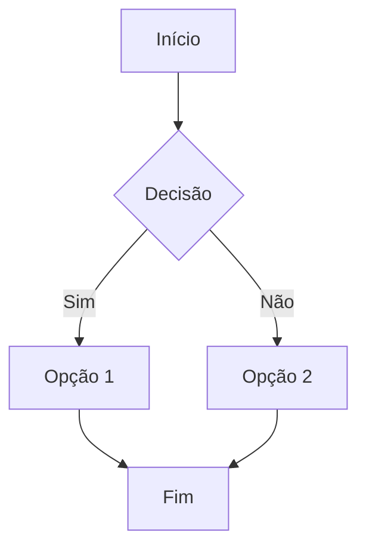

### Fluxograma de Processo

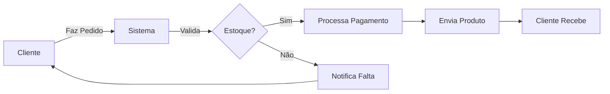

---

## 2. Diagrama de Sequência

### Interação Login

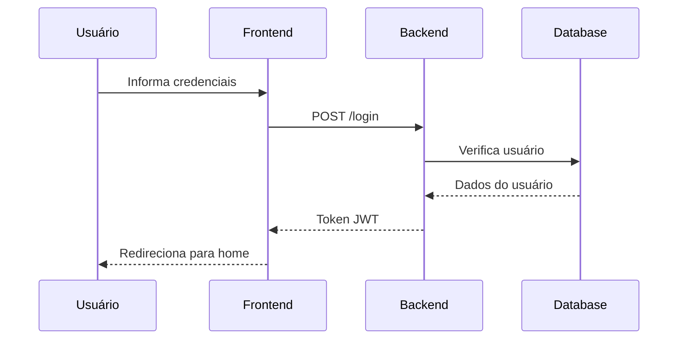

### Fluxo de Pagamento

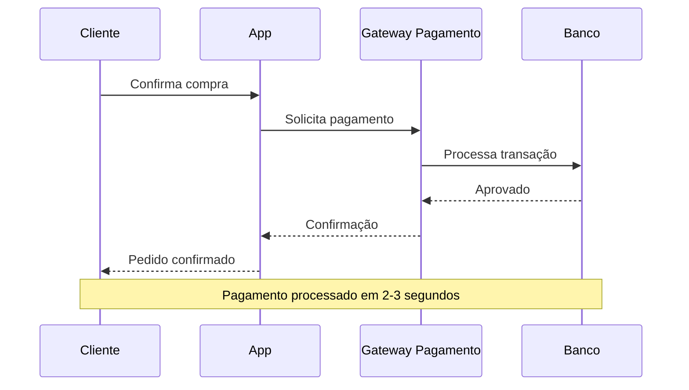

---

## 3. Diagrama de Classes

### Sistema de E-commerce

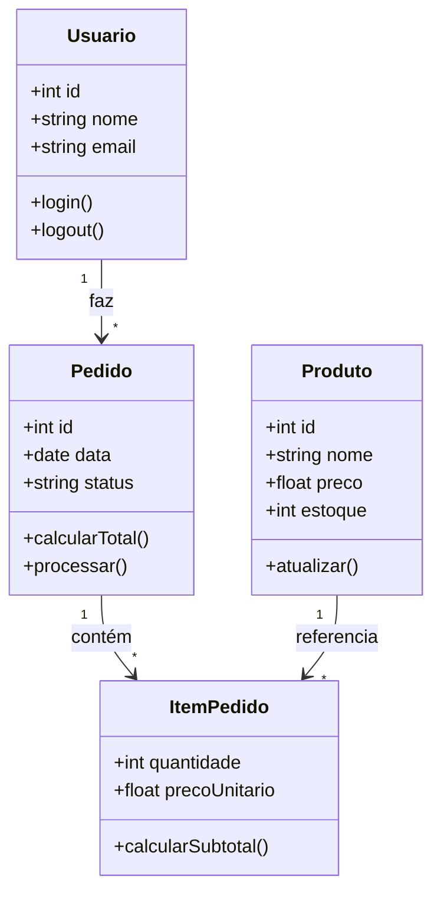

---

## 5. Diagrama de Estados

### Ciclo de Vida de um Pedido

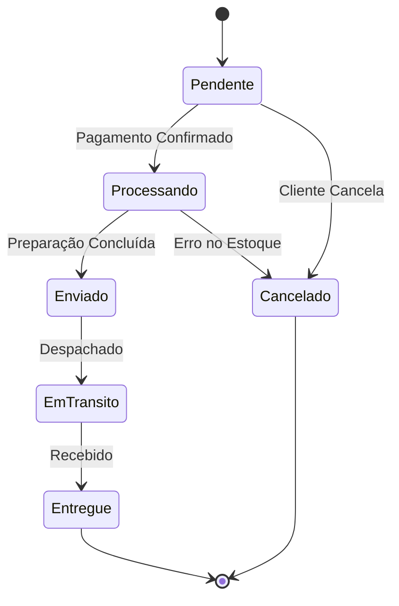

---

## 6. Diagrama de Gantt

### Cronograma de Projeto

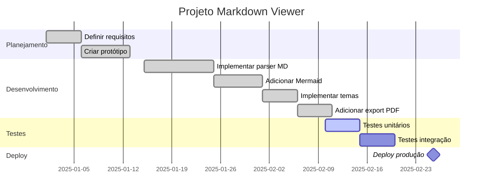

---

## 7. Diagrama de Pizza (Pie Chart)

### Distribuição de Linguagens

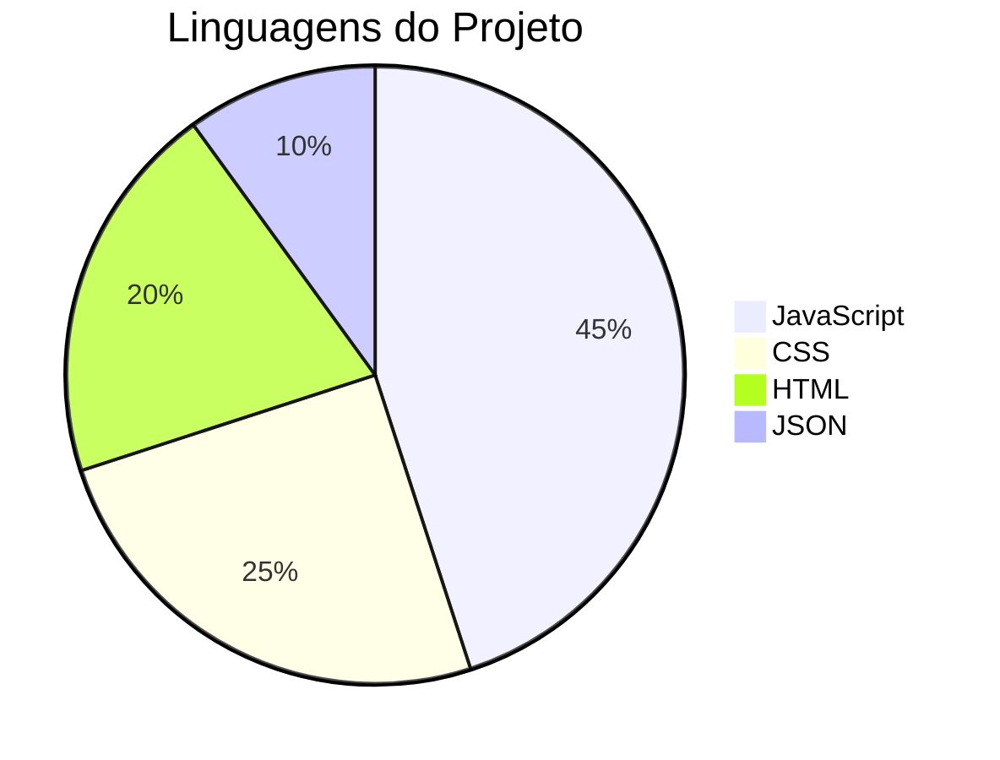

---

## 8. Git Graph

### Histórico de Branches

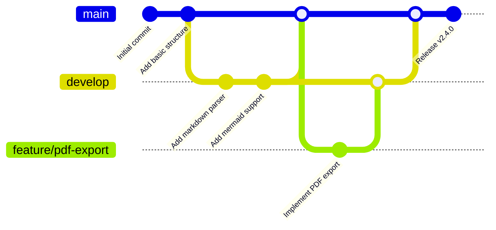

---

## 9. Diagrama com Tags HTML (Caso Especial)

Este exemplo demonstra o suporte a tags HTML em diagramas Mermaid:

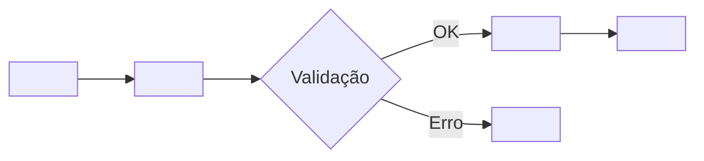

---

## 10. Diagrama de Jornada do Usuário

### Experiência de Compra

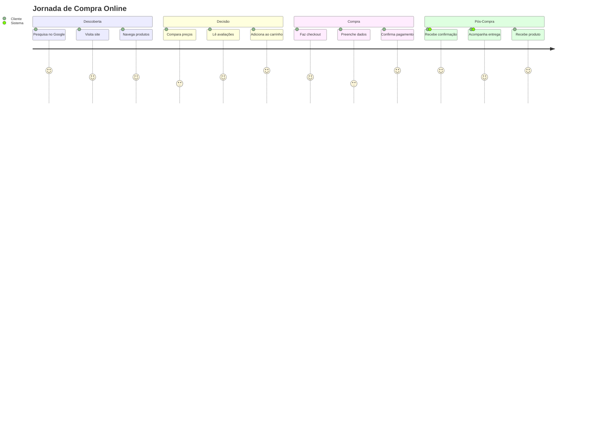

---

## 11. Mindmap

### Estrutura do Projeto

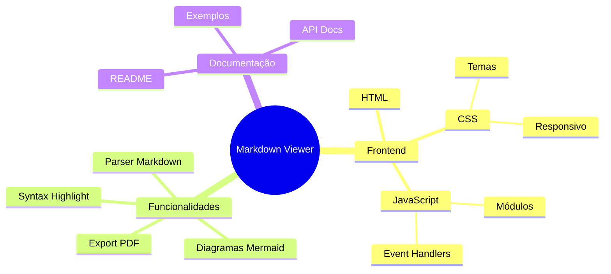

---

## 12. Diagrama de Arquitetura

### Arquitetura da Aplicação

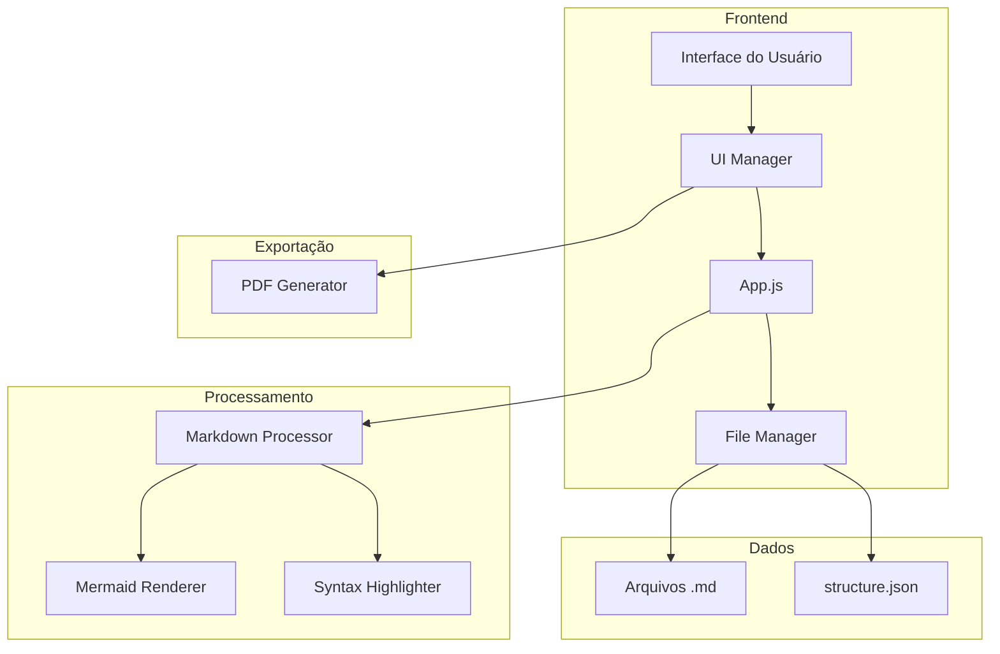

---

## Recursos Interativos

### Controles do Modal

Ao clicar em qualquer diagrama acima:

1. **Zoom Automático Inteligente** ⭐ NOVO!
   - 📐 Diagrama abre automaticamente no tamanho ideal para preencher a tela
   - 🎯 Calcula zoom baseado nas dimensões do diagrama e do modal
   - 📏 Mantém proporções e garante visibilidade completa
   - 🔄 Aplica zoom ótimo automaticamente ao trocar de diagrama

2. **Navegação entre Diagramas** ⭐ NOVO!
   - 🔘 Botões < e > no cabeçalho do modal
   - ⌨️ Setas do teclado (← →)
   - 📊 Contador mostra qual diagrama está visualizando (ex: "3 de 12")
   - 🔄 Troca automática de diagrama com reset de zoom e posição

3. **Zoom Manual**
   - 🖱️ Ctrl + Scroll do mouse
   - ⌨️ Ctrl + Plus/Minus
   - 🔘 Botões + e -
   - Incrementos: 50% até 200%, depois 100% até 1000%
   - Range: 50% (mínimo) até 1000% (máximo)

4. **Navegação no Diagrama**
   - 🖱️ Arrastar e soltar (drag & drop)
   - 📱 Suporte a touch em dispositivos móveis
   - Sensibilidade aumentada (1.5x)

5. **Atalhos de Teclado**
   - `←` `→` - Navegar entre diagramas
   - `F` - Alternar fullscreen
   - `Esc` - Fechar modal
   - `Ctrl+0` - Reset zoom para zoom ótimo automático
   - `Ctrl+` `+` - Aumentar zoom
   - `Ctrl+` `-` - Diminuir zoom

6. **Posicionamento**
   - Diagrama sempre visível do início (topo-esquerda)
   - Scroll automático para (0, 0) ao trocar de diagrama
   - Zoom automático calculado para aproveitar espaço máximo
   - Transform-origin otimizado

---

## Conclusão

O Markdown Viewer oferece suporte completo a diagramas Mermaid com uma experiência interativa e intuitiva. Experimente clicar nos diagramas acima e explorar todos os recursos!

### Tipos de Diagramas Suportados

- ✅ Fluxogramas (Flowchart)
- ✅ Diagramas de Sequência
- ✅ Diagramas de Classes
- ✅ Diagramas ERD
- ✅ Diagramas de Estados
- ✅ Gantt
- ✅ Gráficos de Pizza
- ✅ Git Graph
- ✅ Journey
- ✅ Mindmap
- ✅ E muito mais!

---

**Documentação Mermaid:** [mermaid.js.org](https://mermaid.js.org/)  
**Versão:** 10.6.1
