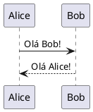
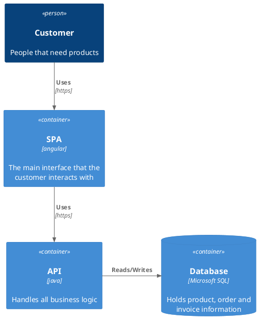

# Teste de Renderização PlantUML

Este arquivo serve para testar a renderização de diagramas PlantUML no Markdown Viewer.

## Exemplo de bloco PlantUML

## Exemplo de bloco plantuml C4_Context

Se o suporte estiver funcionando, o diagrama acima será renderizado como uma imagem SVG gerada pelo PlantUML Server.
