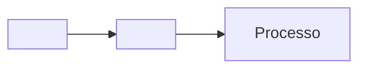

# Markdown Viewer

Um visualizador de arquivos Markdown moderno e interativo com suporte a diagramas Mermaid, syntax highlighting e exportação para PDF.

## 🚀 Características

### 📝 Renderização de Markdown
- Suporte completo à sintaxe Markdown
- Renderização de tabelas
- Listas de tarefas interativas
- Links e imagens
- Blocos de código com syntax highlighting

### 📊 Diagramas Mermaid
- Renderização de diagramas Mermaid
- Modal interativo para visualização ampliada
- Zoom de 50% a 1000% com incrementos inteligentes:
  - 50% em 50% até 200%
  - 100% em 100% de 200% até 1000%
- Suporte a drag-and-drop para navegação
- Modo fullscreen
- Suporte a tags HTML em diagramas

### 🎨 Temas
- Tema claro
- Tema escuro
- Alternância fácil entre temas

### 📄 Exportação para PDF
- Exportação do documento renderizado para PDF
- Formato A4 com margens otimizadas
- Preservação de estilos e formatação
- Geração de nome de arquivo automático

### ⌨️ Atalhos de Teclado

#### Modal de Diagrama Mermaid:
- `Esc` - Fechar modal
- `F` - Alternar fullscreen
- `Ctrl/Cmd + Plus` - Aumentar zoom
- `Ctrl/Cmd + Minus` - Diminuir zoom
- `Ctrl/Cmd + 0` - Resetar zoom para 200%
- `Ctrl/Cmd + Scroll` - Zoom com roda do mouse
- `Arrastar` - Mover diagrama (mouse ou touch)

## 🛠️ Tecnologias Utilizadas

- **HTML5** - Estrutura da aplicação
- **CSS3** - Estilização e temas
- **JavaScript (ES6+)** - Lógica da aplicação
- **[Marked.js](https://marked.js.org/)** - Parser de Markdown
- **[Mermaid.js](https://mermaid.js.org/)** - Renderização de diagramas
- **[Highlight.js](https://highlightjs.org/)** - Syntax highlighting
- **[html2pdf.js](https://github.com/eKoopmans/html2pdf.js)** - Exportação para PDF

## 📦 Estrutura do Projeto

```
Markdown-viewer/
├── index.html              # Página principal
├── README.md               # Este arquivo
├── documentos/             # Documentos Markdown
│   ├── structure.json      # Estrutura de navegação
│   ├── teste-simples.md    # Exemplo simples
│   ├── teste-codigo.md     # Exemplo com código
│   ├── teste-mermaid.md    # Exemplo com diagramas
│   └── porto/              # Documentação do projeto Porto
│       └── legado/         # Documentação legacy
└── src/                    # Código fonte
    ├── css/
    │   └── styles.css      # Estilos da aplicação
    └── js/
        ├── app.js                  # Inicialização
        ├── dynamicFileLoader.js    # Carregamento dinâmico
        ├── fileManager.js          # Gerenciamento de arquivos
        ├── markdownProcessor.js    # Processamento Markdown/Mermaid
        └── uiManager.js            # Gerenciamento de UI
```

## 🚀 Como Usar

### Instalação

1. Clone o repositório:
```bash
git clone https://github.com/dmends/markdown-viewer.git
cd markdown-viewer
```

2. Inicie um servidor HTTP local:
```bash
# Python 3
python3 -m http.server 3000
```
```bash
# Node.js (http-server)
npx http-server -p 3000
```
```bash
# PHP
php -S localhost:3000
```

3. Acesse no navegador:
```
http://localhost:3000
```

### Adicionando Documentos

1. Crie seus arquivos `.md` na pasta `documentos/`
2. Atualize o arquivo `documentos/structure.json` com a estrutura de navegação:

```json
{
  "name": "Meu Documento",
  "path": "documentos/meu-documento.md",
  "children": []
}
```

### Exportando para PDF

1. Abra o documento desejado
2. Clique no ícone de PDF no canto superior direito
3. O PDF será gerado automaticamente com o nome do documento

## 🎯 Funcionalidades Especiais

### Diagramas Mermaid com HTML

O viewer suporta tags HTML dentro de diagramas Mermaid, útil para documentação técnica:



### Temas Personalizados

Os temas são gerenciados via CSS custom properties, facilitando a customização:

```css
:root {
  --bg-primary: #ffffff;
  --text-primary: #333333;
  --accent-color: #0066cc;
}
```

## 🐛 Solução de Problemas

### Diagramas Mermaid não renderizam
- Verifique o console do navegador para erros
- Certifique-se de que a sintaxe Mermaid está correta
- Limpe o cache do navegador (Ctrl+Shift+R)

### Arquivos não carregam
- Verifique se está usando um servidor HTTP (não `file://`)
- Confirme que o `structure.json` está correto
- Verifique os caminhos dos arquivos

### PDF não exporta corretamente
- Aguarde a renderização completa do documento
- Verifique se há erros no console
- Tente com um documento menor primeiro

## 📝 Changelog

### v2.4.2 (Atual)
- ✨ Zoom inteligente com incrementos variáveis
- ✨ Drag-and-drop para navegação em diagramas
- ✨ Posicionamento correto de diagramas no modal
- 🐛 Correção de diagramas cortados no zoom máximo

### v2.4.1
- 🐛 Correção de renderização de HTML em diagramas Mermaid
- 🧹 Limpeza de logs no console

### v2.4.0
- ✨ Exportação para PDF
- ✨ Modal aprimorado para diagramas Mermaid
- ✨ Suporte a fullscreen
- ✨ Controles de zoom avançados

### v2.3.0
- ✨ Sistema de temas (claro/escuro)
- ✨ Syntax highlighting aprimorado
- 🐛 Correções de responsividade

## 🤝 Contribuindo

Contribuições são bem-vindas! Sinta-se à vontade para:

1. Fazer fork do projeto
2. Criar uma branch para sua feature (`git checkout -b feature/NovaFuncionalidade`)
3. Commit suas mudanças (`git commit -m 'Adiciona nova funcionalidade'`)
4. Push para a branch (`git push origin feature/NovaFuncionalidade`)
5. Abrir um Pull Request

## 📄 Licença

Este projeto é open source e está disponível sob a [MIT License](LICENSE).

## 👤 Autor

**dmends**
- GitHub: [@dmends](https://github.com/dmends)

## 🙏 Agradecimentos

- Comunidade Marked.js
- Comunidade Mermaid.js
- Comunidade Highlight.js
- Todos os contribuidores do projeto

---

⭐ Se este projeto foi útil para você, considere dar uma estrela no GitHub!
